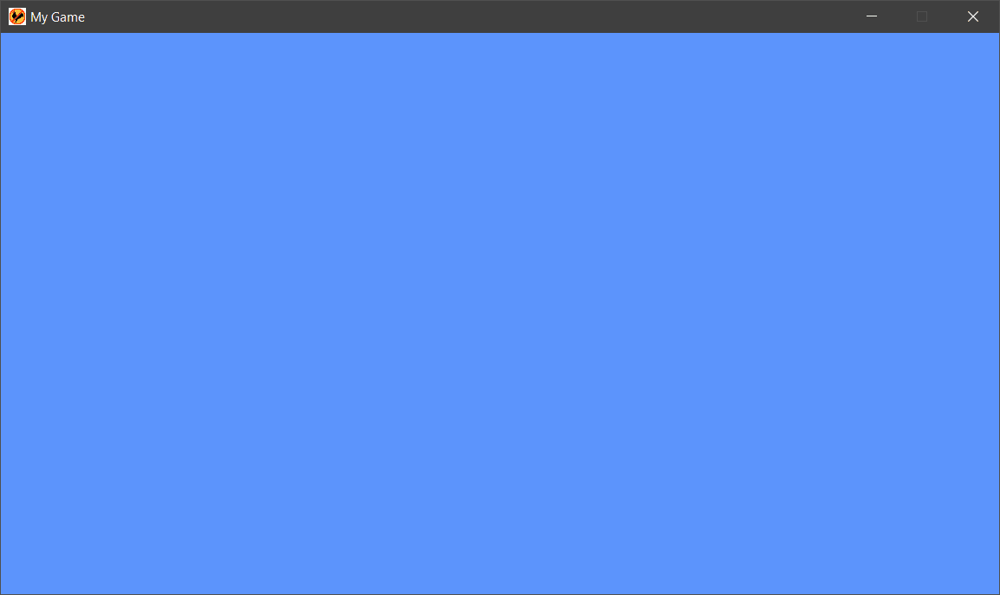

# XJGE - Extensible Java Game Engine 2
XJGE provides developers with an extensible architecture that can be used to facilitate the creation of both 2D and 3D games. It takes the form of a Java library packaged as an executable .jar file that's coupled to several low-level dependencies. XJGE was built using the [Lightweight Java Game Library](https://www.lwjgl.org/).

XJGE is open source and provided free of change under a GNU Lesser General Public License (or LGPL). The source code of the engine may be copied, modified, and redistributed so long as derivative works contain the same notice.

XJGE 2 is a clean rewrite of the legacy version which can be located here: https://github.com/XJGE/XJGE-legacy

Resources:
- [Tutorials](https://xjge.org/tutorials.html)
- [Changelog](https://github.com/XJGE/XJGE-2/blob/master/changelog.md)
- [JavaDoc](https://xjge.org/javadoc/index.html)

### Getting Started
Begin by downloading the latest version of the XJGE then proceed to create a new project in your IDE configuring the engine as described [here](https://xjge.org/tutorials.html).

Detailed below is a simple example that will create a new window and place you into an empty level.

First, you'll want to create a package and create a subclass of Scene called TestScene. scenes can be conceptualized as the games individual levels;
```java
package org.xjge.demo.scenes;

import java.util.Map;
import org.xjge.core.Camera;
import org.xjge.core.Scene;
import org.xjge.graphics.GLProgram;

public class TestScene extends Scene {

    public TestScene(String name) {
        super(name);

        /*
        Called when the scene is first entered. Initialize all of your 
        resources here.
        */
    }

    @Override
    public void update(double targetDelta, double trueDelta) {
        /*
        Used to update game logic. Called automatically by the engine in a
        loop unitl the scene is changed.
        */
    }

    @Override
    public void render(Map<String, GLProgram> glPrograms, int viewportID, Camera camera, int depthTexHandle) {
        /*
        Used to render game objects. Like the update() method, this too is
        called in a loop until the scene is changed.
        */
    }

    @Override
    public void renderShadows(GLProgram depthProgram) {
        /*
        Specialized method that can be used to generate a depth texture.
        Only called when a ShadowMap object has been provided to the scene
        and game entities are providing their mesh/model matrix data to the 
        depth shader program through uniforms.
        */
    }

    @Override
    public void exit() {
        /*
        Used to deallocate memory used by the resources of this scene. Called
        once upon leaving the scene.
        */
    }

}
```

Next, you'll need to initialize the engine and set the first scene. I recommend doing this in the Main method in another package;
```java
package org.xjge.demo.main;

import org.xjge.core.Game;
import org.xjge.core.Window;
import org.xjge.core.XJGE;
import org.xjge.demo.scenes.TestScene;

public class Main {

    public static void main(String args[]) {
        
        /*
        Initializes the engine, sets the filepaths to the assets folder that
        will contain the games textures, sounds, etc. And the scenes folder 
        that will contain subclasses of Scene.
        */
        XJGE.init("/org/xjge/demo/assets/", "org.xjge.demo.scenes.", null);
        
        //The Window class can be used to configure the applications window.
        Window.setTitle("My Game");
        
        //Sets the first scene we'll enter.
        Game.setScene(new TestScene("test"));
        
        //Starts running the engine.
        XJGE.start();
        
    }
    
}
```

Finally, if everything was configured correctly you should get a new window titled "My Game" with a blue sky;



### Features
- Split-Screen Capabilities
- Programmable Graphics Pipeline
- Dynamic 3D Audio
- Built-In Command-Line Interface
- Runtime Diagnostics
- Error Logging
- Multi-Controller Support
- Cameras, Timers, and other Gamplay Tools
- Central Event Queue
- Entity Blueprint System
- Dynamic Lighting, Shadow Mapping, and Bloom Effects
- Skeletal and Sprite Animation
- 3D Model Support
